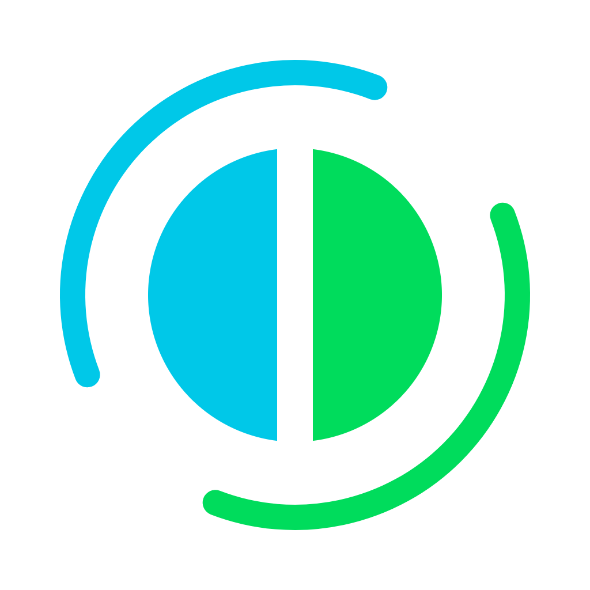
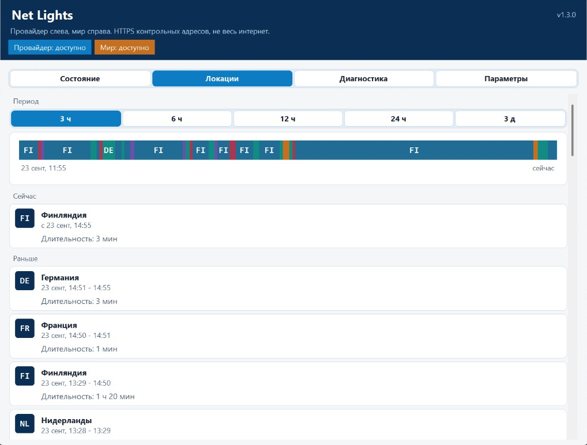

<p align="center">
  
</p>

<h1 align="center">Net Lights</h1>

<p align="center">
  Мониторинг интернета в трее Windows 11.<br />
  Круг из двух половин: слева провайдер, справа мир.
</p>

<p align="center">
  <a href="https://github.com/AryaPaw/net-lights/releases/latest"></a>
  <a href="https://github.com/AryaPaw/net-lights/actions/workflows/ci.yml"></a>
  
  
  
</p>

<p align="center">
  <a href="#как-пользуются">Как пользоваться</a>
  &nbsp;|&nbsp;
  <a href="#установка">Установка</a>
  &nbsp;|&nbsp;
  <a href="#сборка">Сборка</a>
</p>

<p align="center">
      
</p>

Опрашивает контрольные адреса по HTTPS HEAD. DNS, маршруты и сертификаты не трогает. Цвет каждой половины свой:

- **зелёный** — доступно (не меньше двух независимых подтверждений)
- **жёлтый** — ограничено (только одно подтверждение)
- **красный** — нет ответа
- **серый** — нет свежих данных
- **синий** — пауза в меню значка, обе половины

## Окно

Один щелчок по значку открывает окно. Крестик прячет его обратно в трей.

<p align="center">
  
</p>

<p align="center">
  
</p>

На вкладке «Локации» видна страна выхода и график за 3 часа, 6 часов, 12 часов, сутки или три дня.

## Как пользуются

1. Скачайте установщик со страницы [Releases](https://github.com/AryaPaw/net-lights/releases/latest).
2. Запустите его. Права администратора не нужны.
3. Значок появляется в трее и стартует вместе с Windows.

Выход только из меню значка.

Автообновление скачивает Setup с GitHub и ставит его тихо. В «Параметрах» это можно выключить.

## Установка

Нужен **Windows 11 x64**. Отдельный .NET Runtime не нужен. Файл: `NetLights-Setup-win-x64-*.exe`.

## Сборка

Нужен [.NET SDK](https://dotnet.microsoft.com/download/dotnet/10.0) 10. Из корня репозитория `run-local.cmd` публикует и
запускает локальную копию.

```ps1
dotnet test tests/NetLights.UnitTests/NetLights.UnitTests.csproj -c Release
dotnet publish src/NetLights.App/NetLights.App.csproj -c Release -r win-x64 --self-contained true -p:PublishSingleFile=true -o artifacts/publish
```

[GPL-3.0](LICENSE)
