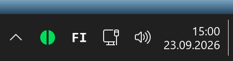
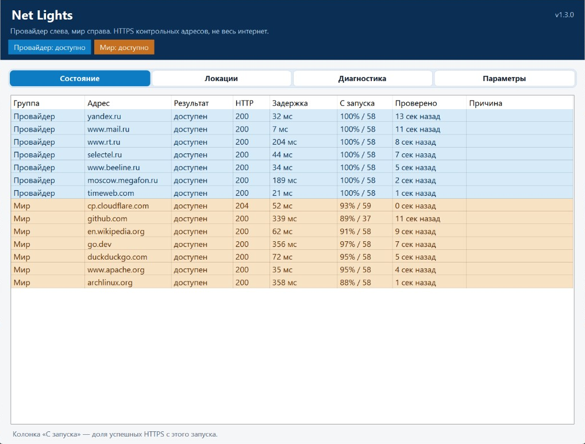

# Net Lights

[](https://github.com/AryaPaw/net-lights/actions/workflows/ci.yml)
[](https://github.com/AryaPaw/net-lights/releases/latest)
[](https://dotnet.microsoft.com/download/dotnet/10.0)
[](https://www.microsoft.com/windows)
[](LICENSE)

Небольшая программа для Windows 11: мониторинг доступа в интернет. Живёт в трее и сама опрашивает контрольные адреса по HTTPS HEAD.

Значок — круг из двух половин. Слева трафик провайдера, справа обычный иностранный интернет. Цвет каждой половины свой. Двойной щелчок открывает окно: таблица узлов, задержки и причины сбоев.

- **зелёный** — доступно (не меньше двух независимых подтверждений)
- **жёлтый** — ограничено (только одно подтверждение)
- **красный** — нет ответа
- **серый** — нет свежих данных

Пауза в меню значка красит обе половины в синий. Программа ничего не меняет в VPN, DNS, маршрутах и сертификатах.





## Установка

Нужен Windows 11 x64. Отдельный .NET Runtime не нужен.

1. Скачайте **NetLights-Setup-win-x64-*.exe** со страницы [Releases](https://github.com/AryaPaw/net-lights/releases/latest).
2. Запустите установщик (права администратора не нужны).

После установки в трее появляется значок, программа запускается вместе с Windows. Окно само не открывается: его открывают двойным щелчком или пунктом меню. Крестик прячет окно в трей. Выход — из меню значка.

## Обновления

Автообновление скачивает Setup с GitHub, ставит его тихо и снова поднимает программу в трей. В «Параметрах» автообновление можно выключить или нажать «Проверить обновления». После сбоя повтор через две минуты.

## Сборка

Нужен [.NET SDK](https://dotnet.microsoft.com/en-us/download) 10. Из корня репозитория `run-local.cmd` публикует и запускает программу.

```ps1
dotnet test tests/NetLights.UnitTests/NetLights.UnitTests.csproj -c Release
dotnet publish src/NetLights.App/NetLights.App.csproj -c Release -r win-x64 --self-contained true -p:PublishSingleFile=true -o artifacts/publish
```

[GPL-3.0](LICENSE)
